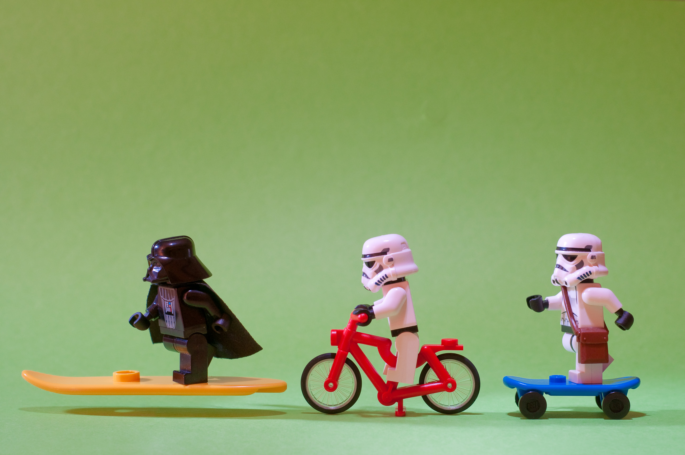
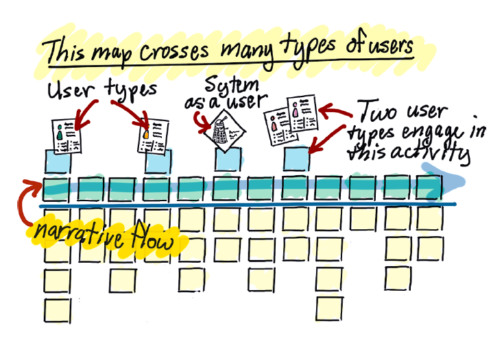

title: What's Your Skateboard?
author:
  name: Emily Stamey
  twitter: elstamey
  url: http://elstamey.com
output: index.html
theme: elstamey/cleaver-reveal-theme
style: my-style2.css
controls: true
progress: true
slideNumber: true

-- titleblock

## Whats Your Skateboard?

photo by [Kenny Louie(https://www.flickr.com/photos/kwl/)

-- slide-me

#Emily Stamey
Application Developer at NC State University

--

####Ripped from the pages of (not really)

--

--

###A Typical MVP Strategy

* Build a prototype
* Break the prototype into components or parts 
* Develop over several months
* At each release, deliver something unusable/incomplete
* Finally learn if the big guess of the prototype was correct
* Changes are much more costly, so most are left alone

--

###Learning Objectives

1. How to story map
2. Sketch a narrative flow
3. Goal-based prioritization
4. Critique the Scholarships story map

--

###What is a Story Map?

A diagram of a project that tells the story of the people and systems 
involved in a process.

Detail is added as we learn more about the project

The map can be built for an existing application or a new application.

-- cover

--

###Who should Story Map?

Anyone who knows the process ... Not Just Developers

At least one knowledgeable person from each group of stakeholders

--

###When to Story Map?

*When you have questions about an application or process

*When you begin new work

*Preferably before you being development
--

###Why Story Map?

*Build shared understanding
*Encourage full discovery before prototyping
*Prioritize work to be done as a group

***Lowers problems with estimates and feature creep** 

-- cover

###The big picture

Photo by [Barnyz](https://www.flickr.com/photos/75487768@N04/8852553227/in/photolist-h8HTU3-JSeov4-h8HPQd-h8HWim-e5dUvX-5fR919-aB8Zp5-sbN2aF-n43Zp-nAUXRk-pw3kjL-qrSmhY-jSiBep-pYPm8B-eugDE4-4Tx3Rt-gUegPw-2Ri5uw-s8m2Qd-7j49P5-reXhVH-dCFW2M-eeoR86-8h1TkG-gsrTKm-4Nxays-dpe7UV-eDky7z-5j5d7W-oXXQy1-nY2L7h-mCqdmy-8RGz3D-nfTd25-6syxwQ-8zLvWC-4y5R9z-8gXBot-aATCWo-NvqGx-67vcv1-nxc6qH-bKhCEr-8w9uH9-65wnjj-5UX21y-3eov4o-BBsrb-668yVg-5W63ti)

-- cover

####Focus during development

[Photo by Theilr](https://www.flickr.com/photos/theilr/6991409092/in/photolist-bDNNm5-dei4BD-hPt5SL-rhRZNN-8a7A6N-c8F4a1-4hHTYQ-bULsP8-nFZm8R-npMA17-a7MRtV-aksL6R-ojpRNK-JtLhP-d1uCHu-6akRDL-nAPrzR-9LPpCP-dMHo1G-4Tb69M-3fK6eh-kEZkGe-5X9ePa-4UNFbB-TFs2-pg3VkM-qmgY5N-8BEgCx-dkYvQv-oVWE1S-dcfhQG-8Zre24-cNJ6sW-eksvWx-e2Woij-6ARqEj-7NcVUv-oiqrhR-9rfVkW-5W1swG-pzBSHK-EZB1y-6bays9-fyamKk-rhgNfR-bvcx6h-4Gaj4U-6vy3ei-kUcpkp-dCVdy)

--

###Where?

A large, clear wall or whiteboard.

A place central to the team, at least in the beginning.

--

###You'll need 

* painter's tape
* markers
* post-its (many colors)

--

###Your Morning

List the first five tasks or activities you did this morning after getting out of bed.

Put each one on a post-it provided

--

###Your Typical Morning

Pick 3 things you normally do in the morning that you didn't do today

--

###Users

Who are the Actors/Users in your morning routine?

--

###Build Activity Groups

Sometimes several tasks can be grouped together. 

--

###Building the narrative

Let's put them together to build a story of your morning!

* There are variations between people, days of week, local and out-of-towners

* If we were automating or tracking some of these morning tasks, we might identify activity groups and prioritize those groups for our application.

--

--

###Anatomy of a Story Map

* Users => actors in the story

* Backbone => user activities

* Walking Skeleton => major user tasks

* User Stories => add detail to the story

* Releases => organize and prioritize stories

* Priorities => Lower Priority stories sink to the bottom

-- cover

--

###Building the map

1. Build and iterate on the full story
2. Frame the structure by labeling the backbone activities and the walking skeleton
3. Loosely prioritize stories based on everyone's needs; lower priorities sink

--

--

-- cover
              

--

###What you get from this

--

###Thorough Discovery

* Understand the full process
  * Understand "why" steps are needed in the process
  * Talk about things inside and outside of the app
* Simplify and lower risk at implementation
  * Lowers the questions at the phase of implementation
  * Limits Feature Creep (beginning implementation w/o understanding, new features come in)
* Better estimates 

Discovery is cheaper at the beginning of a project, than during implementation

--

###Focus on Outcomes

* Prioritize features based on the problem they solve 
* Implement only what solves the problem or meets the objective
 
(instead of perceived importance)

--

##Prioritization Tools

* Who will use this product?
* What steps must they accomplish for success?
* Remove/postpone the rest

--
##Prioritizing Features & Outcomes

* Differentiator - feature sets you apart from competition
* Spoiler - moves in on someone else’s differentiator
* Cost reducer - reduces organizational costs
* Table stakes - feature necessary to compete

-- cover

-- cover

                            

--
###User Story

"A user story is a tool used in Agile software development to capture a 
description of a software feature from an end-user perspective. The user 
story describes the type of user, what they want and why. A user story 
helps to create a simplified description of a requirement."

~Wikipedia

--

###User Story Structure

As a {role}, I want {feature} so that {reason}.

--

###The Story Map
 
Composed of many user stories.

Tells the story of your application.  

It can include parts of the story that happen outside of the application.
