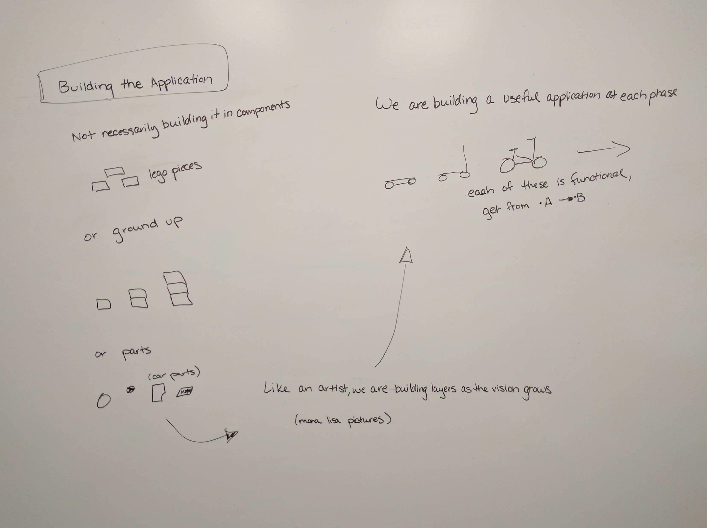

title: What's Your Skateboard?
author:
  name: Emily Stamey
  twitter: elstamey
  url: http://elstamey.com
output: index.html
theme: jdan/cleaver-retro
style: my-style.css
controls: true
progress: true

-- cover

## Whats Your Skateboard?

photo by [Kenny Louie(https://www.flickr.com/photos/kwl/)

--
##Ripped from the pages of (not really)

--

##What we will learn

1. How to build a story map
2. We will build a small map
3. We will talk about a project that used this technique

--

--

#Why use User Story Mapping?

- Builds shared understanding
- Encourages Discovery before Implementation
- Includes all stakeholders in the discussion
- Organizes work to be done

--

#Thorough Discovery Up Front

- Understand the full process
  - Understand "why" steps are needed in the process
  - Talk about things inside and outside of the app
- Simplify and lower risk at implementation
  - Lowers the questions at the phase of implementation
  - Limits Feature Creep (beginning implementation w/o understanding, new features come in)
- Better estimates

Discovery is cheaper at the beginning of a project, than during implementation

--

#Focus on Goals and Outcomes

- Prioritize features based on the problem they solve
- Implement only what solves the problem or meets the objective

(instead of perceived importance)

--

Photo by [Barnyz](https://www.flickr.com/photos/75487768@N04/8852553227/in/photolist-h8HTU3-JSeov4-h8HPQd-h8HWim-e5dUvX-5fR919-aB8Zp5-sbN2aF-n43Zp-nAUXRk-pw3kjL-qrSmhY-jSiBep-pYPm8B-eugDE4-4Tx3Rt-gUegPw-2Ri5uw-s8m2Qd-7j49P5-reXhVH-dCFW2M-eeoR86-8h1TkG-gsrTKm-4Nxays-dpe7UV-eDky7z-5j5d7W-oXXQy1-nY2L7h-mCqdmy-8RGz3D-nfTd25-6syxwQ-8zLvWC-4y5R9z-8gXBot-aATCWo-NvqGx-67vcv1-nxc6qH-bKhCEr-8w9uH9-65wnjj-5UX21y-3eov4o-BBsrb-668yVg-5W63ti)

--

[Photo by Theilr](https://www.flickr.com/photos/theilr/6991409092/in/photolist-bDNNm5-dei4BD-hPt5SL-rhRZNN-8a7A6N-c8F4a1-4hHTYQ-bULsP8-nFZm8R-npMA17-a7MRtV-aksL6R-ojpRNK-JtLhP-d1uCHu-6akRDL-nAPrzR-9LPpCP-dMHo1G-4Tb69M-3fK6eh-kEZkGe-5X9ePa-4UNFbB-TFs2-pg3VkM-qmgY5N-8BEgCx-dkYvQv-oVWE1S-dcfhQG-8Zre24-cNJ6sW-eksvWx-e2Woij-6ARqEj-7NcVUv-oiqrhR-9rfVkW-5W1swG-pzBSHK-EZB1y-6bays9-fyamKk-rhgNfR-bvcx6h-4Gaj4U-6vy3ei-kUcpkp-dCVdy)

--

--

--

--

--

### A textual example

Content can be written in **Markdown!** New lines no longer need two angle brackets.

This will be in a separate paragraph

--

### A list of things

* Item 1
* Item B
* Item gamma

No need for multiple templates!
